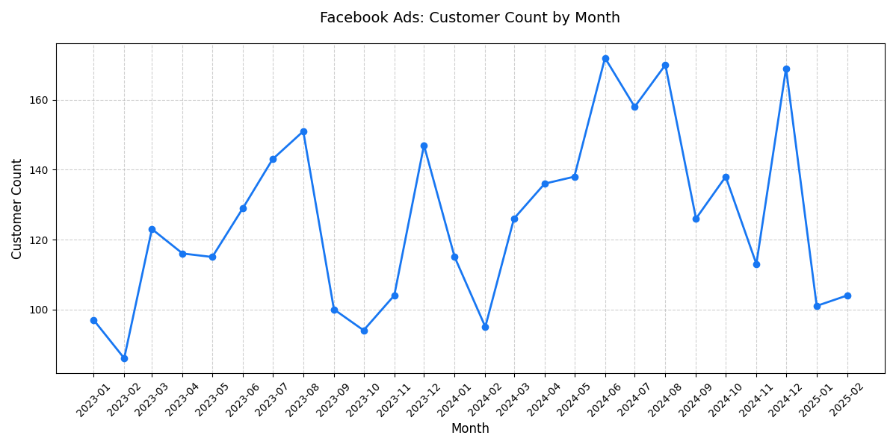

# Week 4: SQL Aggregation

## Use of AI

*   NotebookLM:
    *   I exported query results from Supabase in JSON format and provided them as input to the AI to calculate sums from numerical data, which I could compare with the results of various `count()` queries.
    *   From the data exported from Supabase, I had the AI generate MD-formatted tables for this README.
*   Gemini:
    *   I received the answer that, for example, "fb" and "facebook" are the same marketing channels, but "facebook" and "facebook-ads" are slightly different.
    *   I investigated how to create a test table that copies both data and schema. The new workflow for creating a test table would therefore be as follows:
        ```sql
        -- Delete the old table if it exists
        DROP TABLE IF EXISTS test_web_logs;
        
        -- Create a new table with the entire schema (indexes, constraints, etc.)
        CREATE TABLE test_web_logs (LIKE web_logs INCLUDING ALL);
        
        -- Copy data from the original table
        INSERT INTO test_web_logs SELECT * FROM web_logs;
        ```
    *   I experimented with visualizing the trends of the Facebook Ads marketing channel as a graph, asking the AI to generate the Python script [facebook_ads_monthly_customers_chart.py](individual/facebook_ads_monthly_customers_chart.py) for this purpose. I ran the script using the VS Code development environment and saved the resulting graph as a PNG file.

## Teamwork

*   Consolidated Report: https://github.com/sillepragi/urbanstyle-marketing-data/blob/main/week_4/week4_team_aggregation_report.md
*   My SQL Queries: [week4_marketing_campaign_roi_aggregation.sql](individual/week4_marketing_campaign_roi_aggregation.sql)

### Consolidated Marketing Channel Data

*   There are a total of 50,000 website visits.
*   Marketing channel names are not standardized. Simple text operations like `lower()`, `trim()`, and `replace()` are not enough for standardization, because name forms like "fb" and "facebook" exist, which are essentially the same marketing channel. There are also marketing channels for which it is not yet clear whether they are essentially the same or different, such as "google", "google organic", and "google ads". The latter cases are currently treated as different marketing channels. In total, there are 19 different name forms, which will be reduced to 10 after cleaning.
*   TOP 3 marketing channels by number of website visits:

| Marketing Channel | Number of Website Visits |
| :--- | :--- |
| google organic | 14,094 |
| direct | 9,522 |
| facebook ads | 7,240 |

*   40,585 website visits, or over 80%, are from known customers. The remaining 9,415 are from anonymous users.
*   Marketing channels through which the number of unique customers visiting the UrbanStyle website is over 1000:

| Marketing Channel | Number of Unique Customers |
| :--- | :--- |
| google organic | 1,884 |
| direct | 1,373 |
| facebook ads | 1,186 |

For comparison: the total number of registered customers in UrbanStyle is 3,000, which is smaller than the sum of customer numbers in the table above. This implies that customers visit the UrbanStyle website through multiple marketing channels. If the number of unique customers across all marketing channels is summed, the total is 8,766.

### Marketing Channel Efficiency

The analysis compiles data on unique customers, order volume, and monetary contribution, ranked by the average revenue achieved per customer (efficiency).

| Rank | Marketing Channel | Number of Customers | Orders | Total Revenue (€) | Average Revenue per Customer (€) | Average Number of Orders per Customer |
| :--- | :--- | :--- | :--- | :--- | :--- | :--- |
| 1 | facebook ads | 1,186 | 3,908 | 1,119,519.42 | 943.95 | 3.30 |
| 2 | email campaign | 878 | 2,787 | 812,084.61 | 924.93 | 3.17 |
| 3 | facebook | 371 | 1,177 | 340,486.11 | 917.75 | 3.17 |
| 4 | tiktok | 460 | 1,415 | 401,222.90 | 872.22 | 3.08 |
| 5 | google | 692 | 2,067 | 598,583.95 | 865.01 | 2.99 |
| 6 | google ads | 693 | 2,050 | 587,892.65 | 848.33 | 2.96 |
| 7 | google organic | 1,884 | 5,484 | 1,579,100.68 | 838.16 | 2.91 |
| 8 | instagram | 958 | 2,765 | 792,065.22 | 826.79 | 2.89 |
| 9 | instagram ads | 271 | 767 | 216,661.17 | 799.49 | 2.83 |
| 10 | direct | 1,373 | 3,864 | 1,078,910.51 | 785.81 | 2.81 |

### Monthly Campaign Trends

I investigated the trends in the number of customers who interacted with the **Facebook Ads** marketing channel and placed an order, specifically on a monthly basis.



*   Most customers who placed an order in **June 2024**: **172**
*   Least customers who placed an order in **February 2023**: **86**
*   The number of customers who placed an order grew most in **December 2024**: **+56**.
*   The number of customers who placed an order declined most in **January 2025**: **-68**.

Additionally, it was found that **158** customers who interacted with the **Facebook Ads** marketing channel have never made a purchase.

