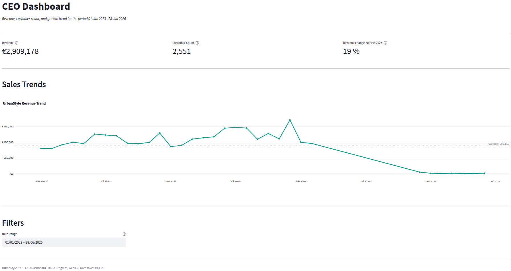

# Week 5: Visualization Design

## Project Overview
This week, the focus was on data visualization and dashboard design for UrbanStyle.ltd stakeholders. I fulfilled the tasks of **Role A (CEO's perspective)** in the group work. My goal was to create a high-level overview of the company's performance, answering CEO's main question: "Are we growing?". As I decided to follow **Track B** for data visualization tools, I used the programming language **Python** and its libraries **Plotly** and **Streamlit** to create the dashboard.

## Dashboard Preview

*Note: The image above is a view of the finished Streamlit application, targeted at the CEO.*

## Use of AI

### Google Gemini

* The example application in the Plotly and Streamlit setup guide loads all 10,118 rows from the `sales` table into memory using Python's **Supabase** library, which communicates with the Supabase database via an HTTP-based API. Since this solution is not scalable (what if the `sales` table had 10 million rows?), I decided to rewrite the source code so that data aggregation and filtering would occur in the database using SQL queries. I asked AI how Python's Supabase library could be used to perform SQL queries. AI responded that other libraries are needed for pure SQL. AI recommended that I install the **SQLAlchemy** library, assisted me with it, and taught me how to use it.
* In cooperation with AI, we found that the Python module `dateutil.relativedelta` is perfectly suited for calculating a comparison period preceding any given date range. This proved necessary for developing a KPI that shows the change in 2024 revenue compared to 2023.
* With the help of AI, we found solutions to various questions related to customizing the appearance of Plotly graphs (e.g., how to change the trend line color to UrbanStyle's brand color).

AI is an indispensable helper for learning Python.

### NotebookLM

* Provided information about the portfolio integration requirements for this week's group work.
* Helped me create a sample template for this README file.

## Business Insights for CEO
Analyzing UrbanStyle's aggregated data, I identified the following key points for the board meeting:

1.  **Growth Trend 2023-2024:** Our monthly sales revenue in 2024 grew by 19% compared to 2023, with growth in the last quarter of 2024 being particularly significant. This confirms that UrbanStyle's strategy in 2023-2024 has been on the right track.
2.  **Incomplete Data from 2025 onwards:** Starting from 2025, there are gaps and other anomalies in the data, making it impossible to objectively assess sales trends from 2025 onwards.

## Technical Implementation
*   **Data Source:** PostgreSQL (Supabase) `sales` table.
*   **Tools:** Python, SQLAlchemy, Pandas, Plotly Express, Streamlit.
*   **Design Principles:** I followed **Tufte's** principles (high data-ink ratio) and **Knaflic's** design thinking. I placed the most important KPI cards at the top of the screen (F-pattern) so that the CEO could understand the situation in 10 seconds. I used UrbanStyle's brand color (#009B8D teal) to highlight trends.

## Team Consolidated Report
Our team's combined investor overview, synthesizing CEO, marketing, and operations perspectives, is located [here](https://github.com/sille-pragi/urbanstyle-marketing-data/blob/main/week_5/investor_dashboard.png).

## How to Run the Application (Ubuntu Linux example)
1.  Ensure Python is installed.
2.  Navigate to the root directory of this repository and create a Python virtual environment: `python -m venv .venv` (if `python` doesn't work, try `python3`).
3.  Activate the Python virtual environment: `source .venv/bin/activate`.
4.  Required libraries are listed in the **requirements.txt** file. Install them: `pip install -r requirements.txt`.
5.  Set up the database connection. Create a `.env` file and add: `SUPABASE_CONNECTION_STRING=[direct_connection_string_of_your_database_in_supabase]`. You can find the appropriate value in your Supabase database settings.
6.  Run the application from the terminal: `streamlit run portfolio/week-05/individual/dashboard/app.py`.

## Source Code

*   Streamlit application: [app.py](./individual/dashboard/app.py)
*   Helper scripts that app.py depends on are located in the same directory.
*   SQL query templates used by the Python code are located in the `sql` subdirectory. **NOTE!** Dynamic parameters in queries must be replaced if they need to be run manually in Supabase.
