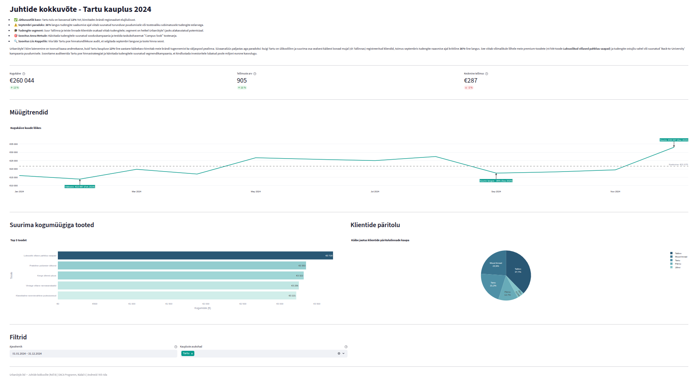

# Nädal 6: Visualiseerimise andmed

## Projekti ülevaade

Sel nädalal oli fookuses andmete viimistlemine ja andmeloo jutustamine (Data Storytelling). Keskendusin grupitöös **Roll B (Tartu kauplus)** ülesannetele, eesmärgiga analüüsida Tartu kaupluse müügidünaamikat, selgitada välja trendide tagamaad ja pakkuda juhtkonnale strateegilisi soovitusi.

**Peamine leid:** Kuigi esialgne hüpotees viitas võimalikule üldisele langustrendile, tuvastas minu analüüs 2024. aastal hoopis **13%-lise käibekasvu** võrreldes 2023. aastaga. Analüüsi käigus selgusid aga kriitilised hooajalised anomaaliad, nagu ootamatu 36%-line langus septembris, ning üllatuslik kliendiprofiil – suurima osa Tartu poe klientidest moodustavad hoopis Tallinnast pärit ostlejad.

**Tehnilised täiendused (Track B):**
*   **Interaktiivsus:** Täiendasin **Streamlit** dashboardi kaupluse asukoha filtriga (`store_location`), mille vaikeväärtuseks määrasin Tartu. Samuti seadistasin kuupäevavahemiku filtri vaikeväärtuseks 2024. aasta, säilitades samal ajal dashboardi täieliku interaktiivsuse teiste perioodide ja asukohtade vaatlemiseks.
*   **Visualiseerimine:** Lisasin müügitrendi iseloomustavale joondiagrammile annotatsioonid ja viitejoone, mis aitavad selgitada andmetes esinevaid liikumisi (nt jõulude müügitipp ja septembri langus) ning muudavad toored numbrid juhitavaks narratiiviks.
*   **Andmete koondamine:** Lisasin populaarseimate toodete müügi visualiseerimiseks tulpdiagrammi ning klientide geograafilise jaotuse esitamiseks sektordiagrammi, mis toetavad Tartu poe spetsiifilist andmelugu.

## Dashboard
Asukoht: https://daca-portfolio-3hkfvtlw9ikvnhidkd5cw3.streamlit.app/

Eelvaade:

*Märkus: Dashboard sisaldab interaktiivseid filtreid.*

## AI kasutamine

### Google Gemini

* Palusin abi `sales.store_location` SQL filtri dünaamilisel kokkupanekul Pythoni koodis vastavalt kasutaja määratud filtritele.
* AI selgitas, kuidas numbriformaadid Streamlit dashboardil saada ühtsele kujule ja kus tuleb selleks vajalikud muudatused teha.
* Küsisin, kuidas lisada annotatsioonid joondiagrammile miinimumi ja maksimumi juurde ja kasutasin vastuseks pakutud koodinäiteid.
* Küsisin, kuidas leida joondiagrammi andmete hulgast suurima protsentuaalse langusega kuu, et seda annotatsioonina kuvada ning AI pakkus välja koodinäited.
* Kui ma paigaldasin enda Streamlit rakendust **Streamlit Community Cloud** keskkonda, siis esines mul tõrkeid Supabase andmebaasiühenduse töölesaamisega. AI soovitas mul kasutada Transaction Pooler URL-i ja juhendas, kuidas see Supabase kasutajaliidesest üles leida. Pärast AI juhiste järgimist tõrked kadusid.

### NotebookLM

* Andes sisendiks enda grupitöö rolli (Roll B - Tartu), dashboardil näidatavate andmete kirjelduse ning endapoolsed soovitused september 2024 järsust langusest järelduste tegemiseks, palusin AI-l koostada juhtide kokkuvõtte ja andmeloo markdown-formaadis.
* AI juhendas, kuhu juhtide kokkuvõte ja andmelugu dashboardil paigutada.

## Tehniline teostus

* **Andmeallikas:** PostgreSQL (Supabase) – andmete filtreerimine toimus serveri poolel (`sales.store_location = 'Tartu'`).
* **Tööriistad:** Python, Pandas, Plotly Express, Streamlit, SQLAlchemy.
* **Disain:** Rakendatud **Knaflici "Storytelling with Data"** põhimõtteid: lisatud annotatsioonid (`fig.add_annotation`) ja viitejoon (`fig.add_hline`).

## Kuidas rakendust käivitada (Ubuntu Linux näitel)

1. Veendu, et Python on installitud
2. Mine käesoleva repositooriumi juurkataloogi ja loo Pythoni virtuaalkeskkond: `python -m venv .venv` (kui `python` ei tööta, proovi `python3`)
3. Aktiveeri Pythoni virtuaalkeskkond: `source .venv/bin/activate`
4. Vajaminevad teegid on loetletud **requirements.txt** failis. Installi need: `pip install -r requirements.txt`
5. Seadista andmebaasiühendus. Loo selleks `.env` fail ja lisa sinna: `SUPABASE_CONNECTION_STRING=[direct_connection_string_of_your_database_in_supabase]`. Sobiva väärtuse leiad oma Supabase andmebaasi seadetest.
6. Käivita rakendus terminalist: `streamlit run portfolio/week-06/individual/dashboard/app.py`

## Lingid
* **Kohalik Streamlit rakendus:** [app.py](./individual/dashboard/app.py)
* **Streamlit Community Cloud keskkonda paigaldatud Streamlit rakendus:** https://daca-portfolio-3hkfvtlw9ikvnhidkd5cw3.streamlit.app/
* **Juhtide kokkuvõte**: vt. [week6_executive_summary.md](./individual/week6_executive_summary.md)
* **Andmelugu**: vt. [week6_tartu_narrative.md](./individual/week6_tartu_narrative.md)
* **Meeskonna koondvaade:** [week6_team_combined_view.md](./team/week6_team_combined_view.md)
