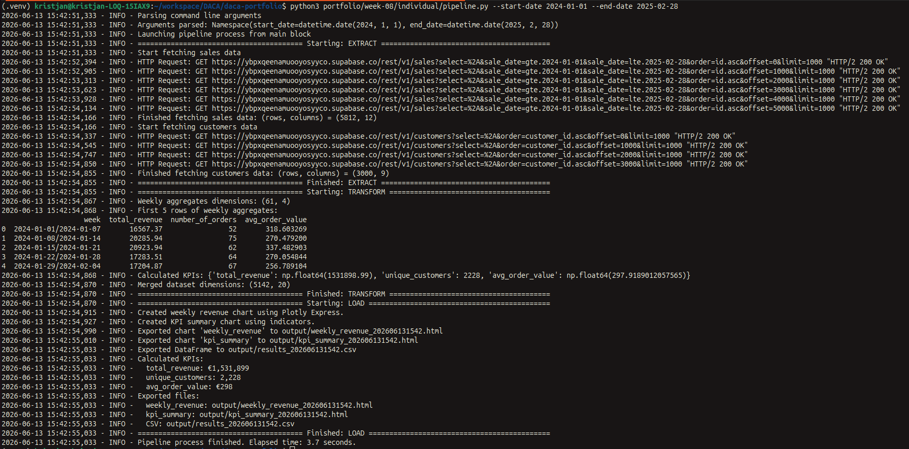

# Week 8: Python APIs

## My Role

### Role D: Automation Script

My task was to write the Python script `pipeline.py`, which combines the modules developed by other team members into a unified **ETL Pipeline**.

*   `pipeline.py` takes a date range as input arguments, which are passed to the `data_fetcher.py` module developed by **Role A**, representing the **E** (Extract) stage in the ETL Pipeline. This module uses the given date range as a filter when querying sales data from Supabase.
*   In addition to sales data, `pipeline.py` also uses the `data_fetcher.py` module to query customer data from Supabase.
*   Sales data queried from Supabase is cleaned using the `transform.py` module developed by **Role B**, representing the **T** (Transform) stage in the ETL Pipeline.
*   The cleaned sales data is again fed into the `transform.py` module to aggregate sales data on a weekly basis and calculate KPI metrics.
*   The `transform.py` module is used to merge the cleaned sales data with customer data.
*   The weekly aggregated sales data is provided as input to the `visualize_export.py` module developed by **Role C**, representing the **L** (Load) stage in the ETL Pipeline. Based on the given input, this module creates a line chart showing total sales revenue by week.
*   The KPI metrics calculated using the `transform.py` module are visualized using the `visualize_export.py` module.
*   The created line chart and KPI metric visualization are again provided as input to the `visualize_export.py` module, based on which these inputs are saved as HTML files. Additionally, the sales and customer data merged by the `transform.py` module are provided as input to save them as a CSV file.
*   `pipeline.py` then provides the list of saved files as input to the `visualize_export.py` module so that the latter can perform additional logging and send notifications if necessary.
*   `pipeline.py` logs the start and end of all three stages and adds additional logging where separate modules do not already do so.
*   `pipeline.py` measures the time taken in seconds to complete the entire ETL Pipeline and logs the result.
*   If an error occurs during the completion of any stage, `pipeline.py` catches it and logs the details of the cause of the error.


*Note: the pipeline execution depicted on the screenshot uses E, T and L stage scripts simulated by me.*

### Automation

To explore further automation possibilities for the ETL Pipeline, I wrote the shell script `bin/weekly_demo.sh`, which demonstrates how to provide the previous week's date range as input to the `pipeline.py` script. During the team presentation, I also showed how this shell script can be configured with `crontab` to run automatically once a week at a specified time.

## Use of AI

### Google Gemini

*   Answered questions on how to achieve certain objectives in Python (e.g., how to read a date range provided as input from the terminal).
*   Helped resolve technical issues that arose during pipeline development.
*   Answered various questions that arose while writing the `bin/weekly_demo.sh` script, e.g., how to calculate the previous week's date range based on the current date.
*   Informed me about a terminal-based AI pair programming tool called **Aider**, which helps automate the use of AI in the development process, and answered my questions on how to set it up and use it.

### Aider + Gemini 2.5 Flash

**Aider** is a terminal-based AI pair programming tool that I encountered for the first time this week. To use Aider, I had to choose an AI model and provide its API key. I used **Gemini 2.5 Flash** as the model, which can be used for free up to a certain limit (20 commands per day).

My goal was to independently complete the tasks of other roles after the team presentation to gain a deeper understanding of the ETL stages and to practice using the Python libraries Pandas and Plotly. I wanted to speed up the work process, but I had come to the conclusion that the Google Gemini chatbot was not sufficient for this.

*   Using Aider, I provided the AI with separate .py files and instructions for writing the functions that `pipeline.py` needed.
*   In the instructions, I described what each function takes as input, the structure of the input, what the function needs to do, and what it returns.
*   The AI made changes to the files according to the given instructions.
*   Once the AI had made the changes to the files, I checked the output, and if it was suitable, I performed `git commit` and `git push`. When setting up Aider, I disabled automatic commits to check the output myself.
*   If the output was not acceptable, I had the AI make the changes again. More detailed problems I solved myself, also using the help of the Google Gemini chatbot.

### NotebookLM

*   To the question of where time-logging should be performed, I received the answer that it should be done in the main block, not in the `run_pipeline()` function.
*   According to the AI, reading script arguments should also be done in the main block and the read arguments should be passed as arguments to the `run_pipeline()` function.

## Technical Implementation

*   **Data Source:** PostgreSQL (Supabase).
*   **Programming Languages:** Python, Bash
*   **Python Modules:** logging, time, argparse, datetime, os, dotenv, supabase, pandas, plotly.
*   **ETL Pipeline Modules:** data_fetcher, transform, visualize_export.
*   **Tools:** VS Code, Git, Aider, Ubuntu terminal, crontab, less, vim.

## Running the Pipeline (Ubuntu terminal)

1.  Ensure Python is installed.
2.  Navigate to the root directory of this repository and create a Python virtual environment: `python3 -m venv .venv`
3.  Activate the Python virtual environment: `source .venv/bin/activate`
4.  Required libraries are listed in the **requirements.txt** file. Install them: `pip install -r requirements.txt`
5.  Configure the database connection using the `.env` file.
6.  Run the pipeline with a suitable date range:

```bash
python3 portfolio/week-08/individual/pipeline.py --start-date=2024-01-01 --end-date=2025-02-28
```

## Location of Teamwork Results

The team pipeline along with its modules is located in the **week_8** directory of the [urbanstyle-marketing-data](https://github.com/sille-pragi/urbanstyle-marketing-data) repository. The setup instructions are similar to the previous point, but running the script is slightly different due to differences in the directory structure:

```bash
python3 week_8/pipeline.py --start-date=2024-01-01 --end-date=2025-02-28
```
