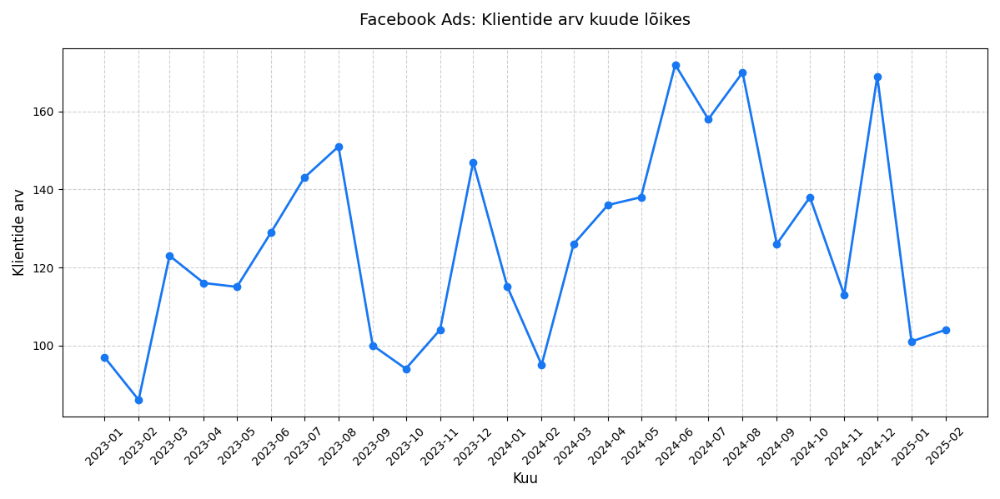

# Nädal 4: SQL agregatsioon

## AI kasutamine

* NotebookLM:
  * Eksportisin Supabase'ist päringutulemusi JSON formaadis ja andsin AI-le sisendiks, et arvutada arvandmete pealt summasid, mida ma saaks võrrelda erinevate count() päringute tulemustega.
  * Supabase'ist eksporditud andmete pealt lasin genereerida MD-formaadis tabeleid käesoleva README jaoks.
* Gemini:
  * Sain vastuseks, et nt. fb ja facebook on samad turunduskanalid, kuid nt. facebook ja facebook-ads on veidi erinevad.
  * Uurisin, kuidas luua testtabel nii, et kopeeritaks lisaks andmetele ka skeem. Testtabeli loomise uus töövoog oleks seega järgmine:
    ```sql
    -- Kustutame vana tabeli, kui see on olemas
    DROP TABLE IF EXISTS test_web_logs;
    
    -- Loome uue tabeli koos kogu skeemiga (indeksid, piirangud jne)
    CREATE TABLE test_web_logs (LIKE web_logs INCLUDING ALL);
    
    -- Kopeerime andmed algsest tabelist
    INSERT INTO test_web_logs SELECT * FROM web_logs;
    ```
  * Katsetasin Facebook Ads turunduskanali trendide visualiseerimist graafikuna, paludes selleks AI-l genereerida Pythoni skript [facebook_ads_monthly_customers_chart.py](individual/facebook_ads_monthly_customers_chart.py). Jooksutasin skripti VS Code'i arenduskeskkonna abil ning salvestasin saadud graafiku PDF failina.

## Meeskonnatöö

* Koondraport: https://docs.google.com/document/d/1R7yLGLHO6CHmOL75oUjyiKYUK_8N7ghAnALVK6LZufA/edit?tab=t.0
* SQL päringud: [week4_marketing_campaign_roi_aggregation.sql](individual/week4_marketing_campaign_roi_aggregation.sql)

### Turunduskanalite koondandmed

* Kokku on 50 000 veebikülastust.
* Turunduskanalite nimed on ühtlustamata. Ühtlustamiseks ei piisa lihtsatest tekstioperatsioonidest, nagu lower(), trim() ja replace(), sest esinevad nimekujud, nagu nt. "fb" ja "facebook", mis sisuliselt on üks ja seesama turunduskanal. Esineb ka turunduskanaleid, mille puhul pole hetkel veel selge, kas need on sisuliselt samad või erinevad, näiteks "google", "google organic" ja "google ads". Viimatimainitud juhtumeid käsitleme praegu erinevate turunduskanalitena. Kokku on 19 erinevat nimekuju, millest peale puhastamist jääb järgi 10.
* Veebikülastuste arvult TOP 3 turunduskanalit:

| Turunduskanal | Veebikülastuste arv |
| :--- | :--- |
| google organic | 14 094 |
| direct | 9 522 |
| facebook ads | 7 240 |

* 40 585 veebikülastust ehk üle 80% on sellised, kus klient on teada. Ülejäänud 9415 on anonüümsetelt kasutajatelt.
* Turunduskanalid, mille kaudu UrbanStyle veebisaiti külastanud unikaalsete klientide arv on üle 1000:

| Turunduskanal | Unikaalsete klientide arv |
| :--- | :--- |
| google organic | 1 884 |
| direct | 1 373 |
| facebook ads | 1 186 |

Võrdluseks: registreeritud kliente on UrbanStyle'is kokku 3000, mis on väiksem, kui ülalpooltoodud tabelis klientide arvu kokkuliitmisel saadav arv. Siit järeldub, et kliendid külastavad UrbanStyle'i veebisaiti läbi mitme turunduskanali. Kui üle kõikide turunduskanalite unikaalsete klientide arvud kokku liita, siis tuleb summaks 8766.

### Turunduskanalite efektiivsus

Analüüs koondab andmed unikaalsete klientide, tellimuste mahu ja rahalise panuse kohta, reastatuna kliendi kohta saavutatud keskmise käibe (efektiivsuse) alusel.

| Koht | Turunduskanal | Klientide arv | Tellimusi | Kogukäive (€) | Keskmine käive kliendi kohta (€) | Keskmine tellimuste arv kliendi kohta |
| :--- | :--- | :--- | :--- | :--- | :--- | :--- |
| 1 | facebook ads | 1 186 | 3 908 | 1 119 519,42 | 943,95 | 3,30 |
| 2 | email campaign | 878 | 2 787 | 812 084,61 | 924,93 | 3,17 |
| 3 | facebook | 371 | 1 177 | 340 486,11 | 917,75 | 3,17 |
| 4 | tiktok | 460 | 1 415 | 401 222,90 | 872,22 | 3,08 |
| 5 | google | 692 | 2 067 | 598 583,95 | 865,01 | 2,99 |
| 6 | google ads | 693 | 2 050 | 587 892,65 | 848,33 | 2,96 |
| 7 | google organic | 1 884 | 5 484 | 1 579 100,68 | 838,16 | 2,91 |
| 8 | instagram | 958 | 2 765 | 792 065,22 | 826,79 | 2,89 |
| 9 | instagram ads | 271 | 767 | 216 661,17 | 799,49 | 2,83 |
| 10 | direct | 1 373 | 3 864 | 1 078 910,51 | 785,81 | 2,81 |

### Kampaaniate kuised trendid


